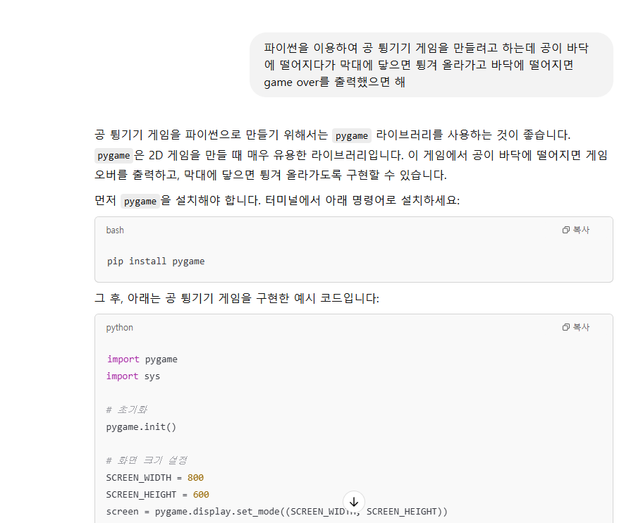
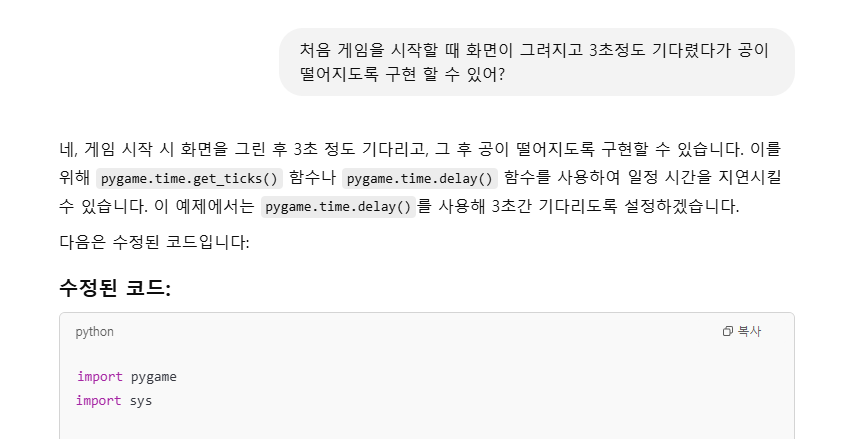
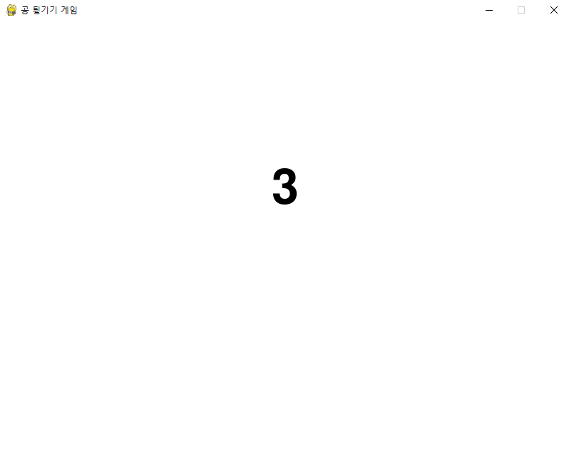
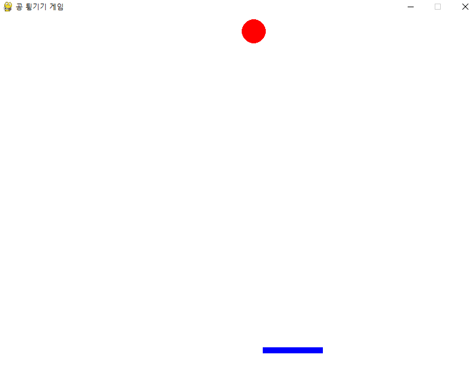
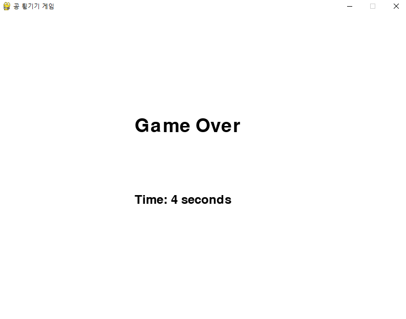

# 코드를 직접 작성하지 않고 게임 만들기 

chatGPT를 이용하여 직접 코드를 작성하지 않고 공 튕기기 게임을 만들어 보았습니다.

miniconda를 활용해 개발환경을 설정하고, 편집기는 VScode를 이용하였습니다.

위 사진과 같이 질문을 하고 

과 같이 수정을 하면서 게임을 완성하였습니다.
아래는 게임 소개 입니다. 

# 공 튕기기 게임

## 게임 설명
이 게임은 화면에서 공이 떨어지다가 막대에 닿으면 튕겨 올라가는 간단한 게임입니다. 공이 바닥에 떨어지면 게임이 종료되며, 플레이어는 공이 떨어지는 시간을 최대한 오래 버티는 것이 목표입니다.

## 게임 진행 방식
1. 게임을 시작하면, 카운트다운 (3, 2, 1)이 진행됩니다.
2. 카운트다운 후, 공이 화면 위에서 떨어지기 시작합니다.
3. 플레이어는 좌우 방향키를 이용해 막대를 움직여 공이 떨어지지 않도록 막아야 합니다.
4. 공이 막대에 닿으면 위로 튕겨 올라가며, 다시 바닥에 떨어지지 않도록 막대 위치를 조정해야 합니다.
5. 공이 바닥에 떨어지면 게임이 종료되며, 게임 종료 시 플레이어가 공을 튕긴 시간이 초 단위로 표시됩니다.

## 기능
- 게임 시작 시 3초의 카운트다운 후 공이 떨어집니다.
- 플레이어는 좌우 화살표 키로 막대를 움직여 공을 튕겨 올릴 수 있습니다.
- 공은 벽에 튕기거나 막대에 닿으면 반사되어 튕겨 나갑니다.
- 공이 바닥에 떨어지면 게임이 종료되고, 플레이어가 공을 튕긴 시간을 초 단위로 표시합니다.

## 사용 기술
- **Pygame**: Python의 게임 개발 라이브러리를 사용하여 그래픽을 그립니다.
- **게임 요소**: 공, 막대, 배경 색상, 텍스트 출력 등을 구현합니다.

## 게임 화면
- 배경은 하얀색으로 설정되어 있으며, 공은 빨간색, 막대는 파란색으로 표시됩니다.
- 게임 시작 화면에서 카운트다운 후, 게임이 시작됩니다.
- 게임 오버 화면에서는 플레이어가 버틴 시간이 초 단위로 표시됩니다.

## 게임 화면 

- 시작 화면(카운트다운)

- 게임 화면 

- 종료 화면 
